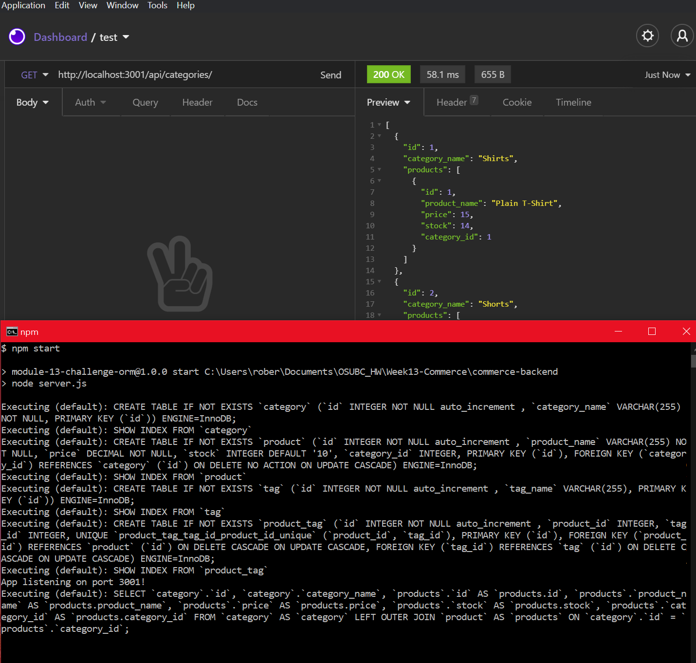

# e-commerce back-end

## Description
back-end code for an e-commerce website

## Table of Contents
- [Description](description)
- [Installation](Installation)
- [Usage](Usage)

## Installation
After you clone this repo, before the first time you run the app, you will need to use the data in the `mysql` folder to create the data base. There is also some seed data you can feel free to use or any of your own! Once the data base has been made, go into the `.env.EXAMPLE` file and put your mysql username and password in for your local server(username in the `DB_USER` quoted area, and password in the `DB_PW` quoted area). After that, go to your terminal and run `npm i`, then `npm run seed` to seed the provided data. Now you're ready to run command `npm start` and use the app!

## Usage
Once you've run the `npm start` command, you can use Insomnia Core to see the back end code work!

[Demo Video](https://youtu.be/Qxz4cYn56cs)

